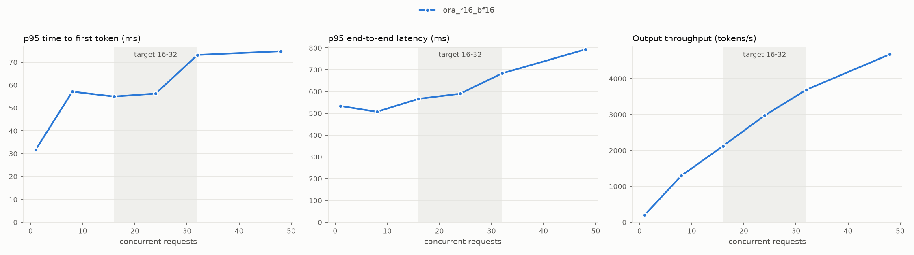

# Serving benchmark (latencies in ms)

| variant | workload | conc. | req/s | out tok/s | TTFT p50 | TTFT p95 | TTFT p99 | TPOT p50 | TPOT p95 | E2E p50 | E2E p95 | E2E p99 | failed |
|---|---|---|---|---|---|---|---|---|---|---|---|---|---|
| lora_r16_bf16 | fixed128 | 1 | 1.7 | 216.9 | 12.8 | 16.4 | 18.0 | 4.5 | 4.6 | 588.5 | 599.4 | 606.3 | 0 |
| lora_r16_bf16 | fixed128 | 8 | 12.3 | 1570.1 | 21.3 | 27.8 | 29.9 | 4.9 | 5.1 | 649.4 | 671.0 | 674.3 | 0 |
| lora_r16_bf16 | fixed128 | 16 | 22.6 | 2893.4 | 23.3 | 42.2 | 43.3 | 5.3 | 5.5 | 703.6 | 731.9 | 735.1 | 0 |
| lora_r16_bf16 | fixed128 | 24 | 31.0 | 3961.6 | 26.2 | 51.4 | 58.0 | 5.8 | 6.0 | 771.3 | 800.2 | 809.6 | 0 |
| lora_r16_bf16 | fixed128 | 32 | 39.0 | 4996.5 | 29.5 | 64.0 | 76.4 | 6.2 | 6.4 | 818.0 | 849.5 | 860.5 | 0 |
| lora_r16_bf16 | fixed128 | 48 | 48.3 | 6181.6 | 40.7 | 93.4 | 131.2 | 7.3 | 8.5 | 985.1 | 1125.8 | 1150.0 | 0 |
| lora_r16_bf16 | natural | 1 | 4.9 | 207.1 | 12.6 | 31.8 | 63.1 | 4.5 | 4.6 | 156.3 | 533.8 | 1178.2 | 0 |
| lora_r16_bf16 | natural | 8 | 33.3 | 1293.2 | 18.7 | 57.1 | 68.3 | 5.1 | 7.4 | 189.4 | 506.8 | 834.4 | 0 |
| lora_r16_bf16 | natural | 16 | 58.8 | 2121.4 | 24.1 | 55.0 | 65.6 | 6.3 | 9.3 | 226.6 | 566.4 | 743.7 | 0 |
| lora_r16_bf16 | natural | 24 | 84.9 | 2971.7 | 24.2 | 56.3 | 64.7 | 5.9 | 11.3 | 229.1 | 590.2 | 988.7 | 0 |
| lora_r16_bf16 | natural | 32 | 107.7 | 3689.5 | 25.5 | 73.2 | 122.3 | 6.1 | 14.3 | 225.2 | 683.1 | 986.9 | 0 |
| lora_r16_bf16 | natural | 48 | 131.3 | 4673.0 | 29.8 | 74.8 | 115.3 | 7.0 | 14.0 | 275.4 | 793.1 | 1196.6 | 0 |

